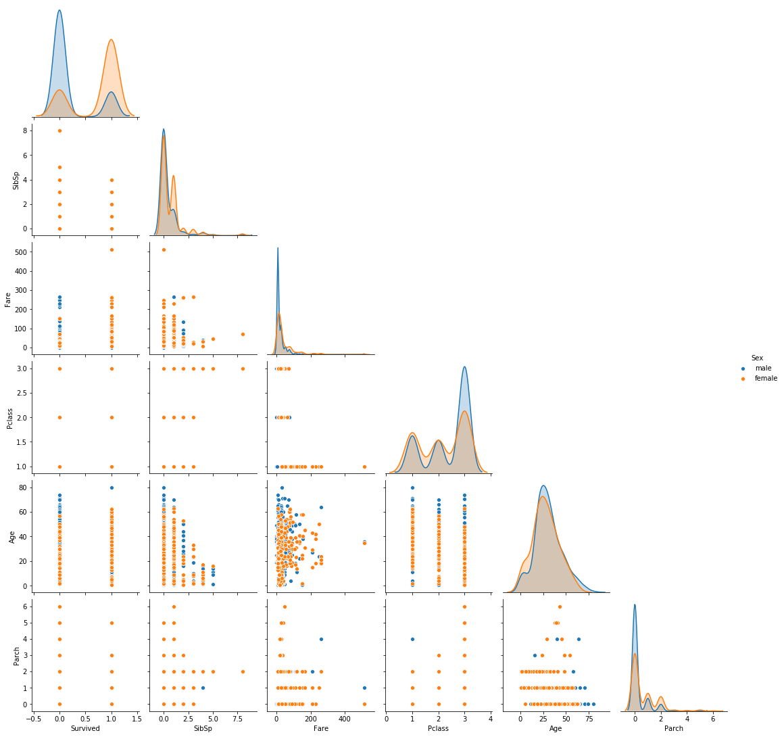
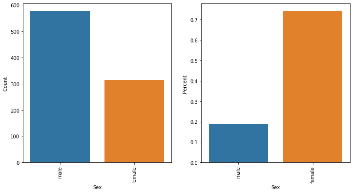
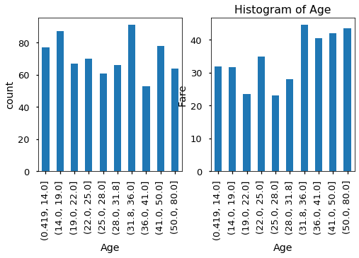
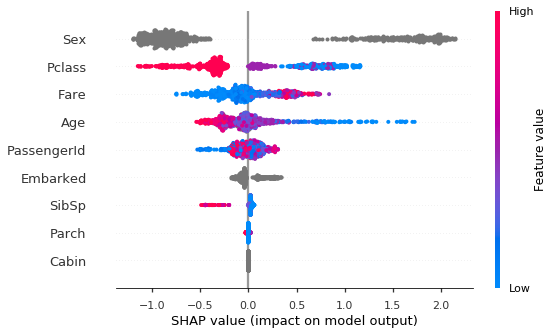
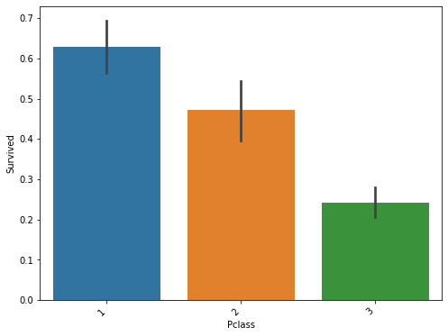
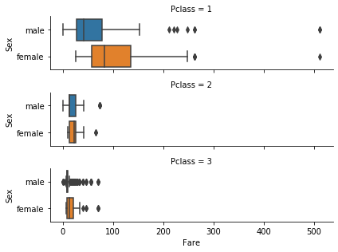

# OLEDA

 Exploratory Data Analysis with python.
 
- Automatic report generation from a pandas DataFrame.
- Datasets comparision.
- Insights from data.


Usage/installation
------------------
to install oleda:
```bash
 sudo python3 setup.py install
```
Examples/Usage
--------

to explore single dataset and create report just type:
```python
import oleda
oleda.report(df)
```
report contains:
- missing values statistics
- information on each feature relevant for the feature type
- pearson correlation heatmap
- Cramers V staticstics (https://stackoverflow.com/a/46498792/5863503)
- pair plot for most correlated features
- if dataframe index is valid datetime index, time series plots are added to the report

dataset can be tested against an target variable (binary (0,1) or continues):  

```python
oleda.report(df,target,ignore=[],nbrmax=20)
```
in this case plots that show correlation with targed are added for each feature
features are sorterted according to their impotantce by shap (https://github.com/slundberg/shap)
nbrmax number of most important features selected by shap to be explored
features need to be ignored can be added in ignore list 

also two datasets can be compared:
```python   
oleda.pairwise_report(df1,df2,ignore=[],nbrmax=20)
```
first oleda find by shap most significant features that distinguish these datasets
then prints their statistics side by side to show the difference

Example using Titanic dataset :
https://github.com/Banuba/oleda/blob/1ea82833d355a1cd45f52ea9376973600488629e/example/Titanic-oleda.ipynb

plots description:

1. number and persent of missed values per feature:

<h2 align="center">Missed values</h2>
      
              Missing Values  % of Total Values
    Cabin                687               77.1
    Age                  177               19.9
    Embarked               2                0.2

2. plots for categorical features:
- histogram , representation of the distribution of feature

- pair plot of 10 most correlated features, which significantly varies ( ANOVA ) on values of this categorecal feature, colored according to features values:

- if target feature is set (for example 'Survived' ) then barplot with target mean on feature values is displayed side by side with feature histogram

etc

3. plots for numerical features:
- distribution plot and box plot are displayed:

- if target feature is set , scatter plot and violine (if target is binary ) or catplot are added (depends on target type):


- variables also are splited on bins based on quantiles and plotted against target:


 
4. feature correllation heatmap

5. Cramers V staticstics


to compare survived not survived subsets of Titanic dataset one can run:

```python   
oleda.pairwise_report(df[df['Survived']==0],df[df['Survived']==1],ignore=['Survived'])
```
result will contain plots like:
- shap importance information (https://github.com/slundberg/shap)



- features plots from both dasets side by side:


and more...

to create 2nd order interactions plots:
```python 
eda.interactions2x(df,maxnbr=6)
```
oleda will check categorical varibles and binned numerical against the numerical varibles by ANOVA
and in case if diffrence in means is significant, display plots and Tukey's HSD (honestly significant difference) test results

<h3 align="center">Ticket - Parch</h3>




    turkeyHSD
              group2  meandiff   p-adj   lower   upper  reject
    group1                                                    
    1601      347082    2.8571  0.0010  1.2786  4.4356    True
    1601    CA. 2343    2.0000  0.0095  0.4215  3.5785    True
    1601     3101295    1.6667  0.0459  0.0237  3.3096    True
    
    
and pairplots of 10 most correlated features colored by maxnbr most common categorical varible values


maxnbr - max feature values to test and plot (affects speed)

to create 3nd order interactions plots:
```python 
eda.interactions3x(df,maxnbr=6)
```


