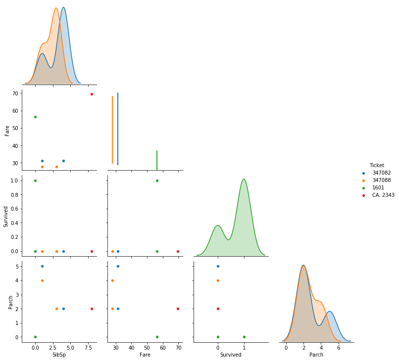

# OLEDA

 Exploratory Data Analysis with python.
 
 Automatic report generation from a pandas DataFrame.
 Datasets comparision.
 Insights from data.


Usage/installation
------------------
to install oleda
```bash
 sudo python3 setup.py install
```
Examples
--------

to explore single dataset and create report just type:
```python
from oleda import eda
eda.report(df)
```
report contains:
- missing values statistics
- information on each feature relevant for the feature type
- pearson correlation heatmap
- Cramers V staticstics (https://stackoverflow.com/a/46498792/5863503)
- pair plot for most correlated features
- if dataframe index is valid datetime index, time series plots are added to the report

dataset can be tested against an target variable (binary (0,1) or continues):  

```python
eda.report(df,target,ignore=[],nbrmax=20)
```
nbrmax number of most important features selected by shap are explored
features need to be ignored can be added in ignore list 
all featers are tested against the target feature

 
plots for categorical features:

- histogram , representation of the distribution of data

- pair plot of 10 most correlated features, which significantly varies ( ANOVA ) on values of this categorecal feature colored according to features values:

- if target feature is set then barplot with target mean on feature values is displayed side by side with histogram

etc

plots for numerical features:
- distribution plot and box plot are displayed:

- if target feature is set , scatter plot and violine (if target is binary ) or catplot are added:

 
to compare datasets please use:
```python   
eda.pairwise_report(df1,df2,ignore=[])
```


to run feature selection tests and print table to compare results:
```python 
feature_selection.run_all(df,target,max_nbr_features_to_select)
```

to create 2nd order interactions plots:
```python 
eda.interactions2x(df,maxnbr=6)
```
maxnbr - max feature values to test and plot (affects speed)

to create 3nd order interactions plots:
```python 
eda.interactions3x(df,maxnbr=6)
```

